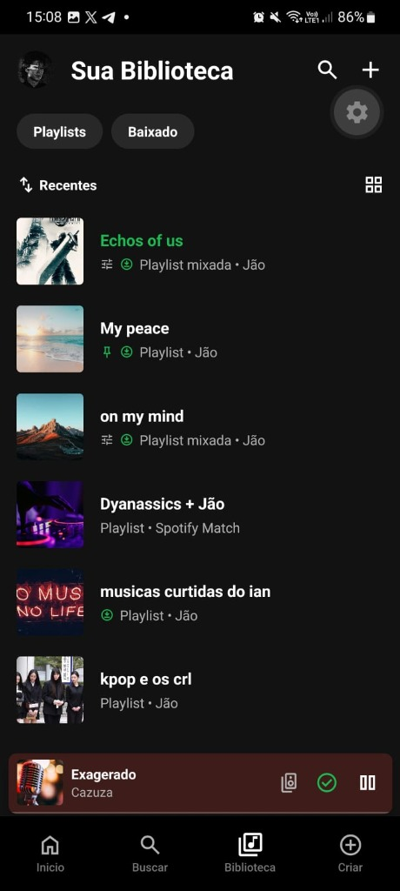
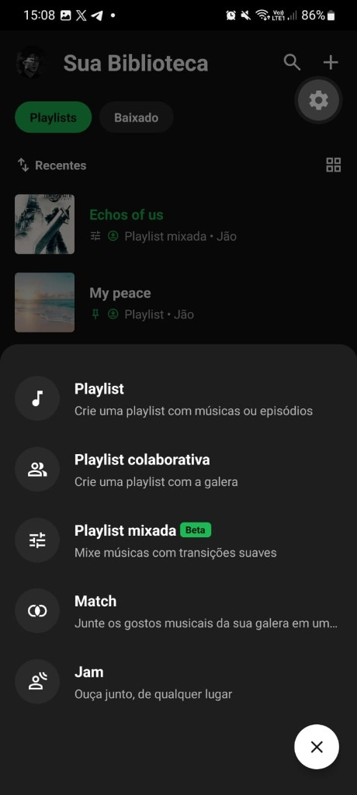
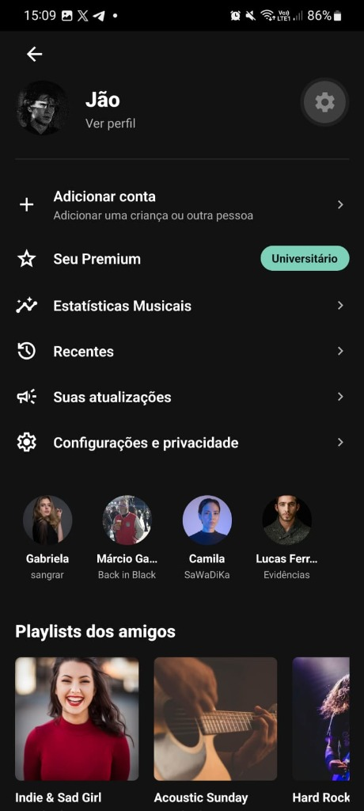
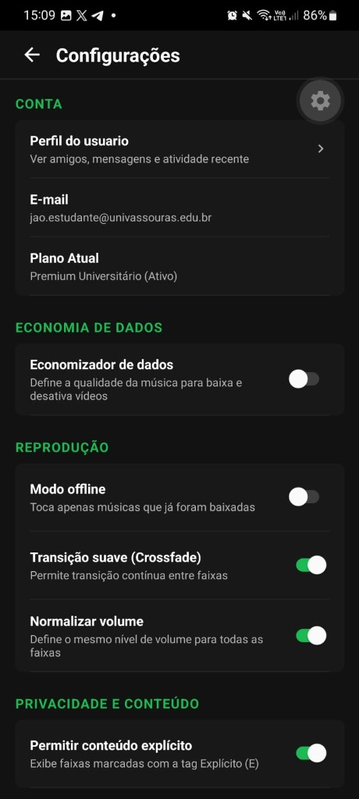
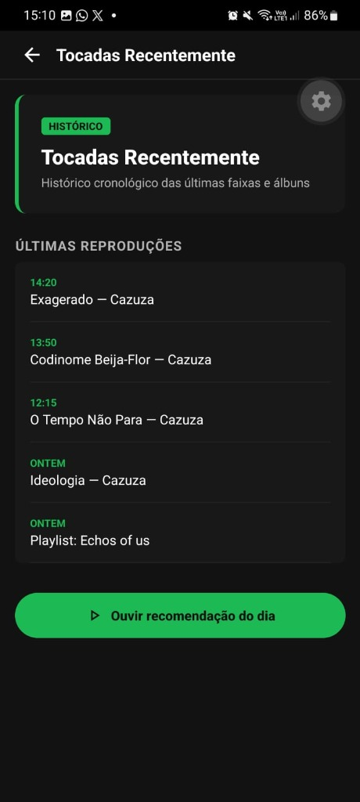
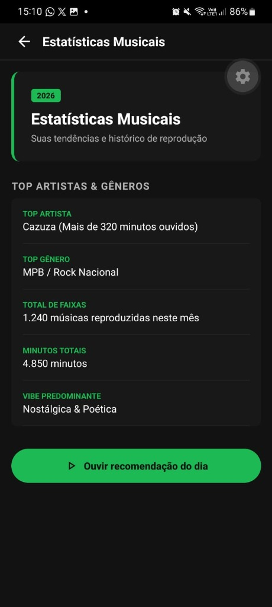

# Spotiflow Mobile - Avaliacao P1

> **Disciplina:** Desenvolvimento de Aplicativos Hibridos  
> **Professor:** Marcio Garrido  
> **Instituicao:** Universidade de Vassouras (Univassouras)  
> **Integrantes (Dupla):** Ian & Joao Victor (Jao)  
> **Tecnologias:** React Native, Expo Router (SDK 57), TypeScript  

---

## Sobre o Projeto

Este e o Spotiflow, aplicativo mobile desenvolvido para a avaliacao da P1 da disciplina de Desenvolvimento de Aplicativos Hibridos.

A proposta do trabalho foi escolher uma aplicacao consolidada de mercado para mocar em ambiente hibrido utilizando React Native com Expo, aplicando os conceitos ensinados em aula:
- Roteamento baseado em arquivos com Expo Router;
- Gerenciamento de estado global com Context API (mantendo o player em reproducao continua durante a navegacao);
- Componentizacao limpa, estilizacao em tema escuro (Dark Theme do Spotify) e tipagem com TypeScript;
- Dados mockados com artistas, faixas e duracoes reais, capas personalizadas e playlists diversificadas por usuario.

O projeto possui 10 telas navegaveis e interativas, superando a meta minima de 6 telas solicitada no slide de avaliacao. A seguir, detalhamos as telas capturadas diretamente em execucao real no dispositivo.

---

## Como Rodar o Projeto Localmente

Para clonar e executar o projeto:

### Pre-requisitos
- Node.js instalado (v18 ou superior)
- Gerenciador de pacotes npm ou yarn
- Aplicativo Expo Go no smartphone (Android ou iOS)

### Execucao

1. Clone o repositorio:
   ```bash
   git clone https://github.com/arywnz/P1_Desenvolvimento_apps_hibridos.git
   cd P1_Desenvolvimento_apps_hibridos
   ```

2. Acesse a pasta do aplicativo e instale as dependencias:
   ```bash
   cd spotiflow-mobile
   npm install
   ```

3. Inicie o servidor do Expo:
   ```bash
   npx expo start -c
   ```

4. Abertura no dispositivo:
   - Escaneie o QR Code exibido no terminal utilizando o app Expo Go.
   - Ou pressione a tecla w no terminal para abrir a versao Web no navegador.

---

## Telas do Sistema e Fluxo de Navegacao

Abaixo estao as telas reais do aplicativo em execucao, demonstrando o fluxo de uso:

---

### 1. Sua Biblioteca (src/app/(tabs)/library.tsx)
Painel de organizacao das colecoes do usuario logado (Jao). Possui filtros no topo (Playlists, Baixado), alternancia de visualizacao e ordenacao por atividade recente.

<p align="center">
  
</p>

- **Playlists personalizadas:**
  - Echos of us: Capa tematica de Final Fantasy VII Remake, contendo faixas da trilha sonora de Final Fantasy VII (Nobuo Uematsu), The Witcher 3: Wild Hunt (Marcin Przybylowicz) e classicos da MPB/Rock.
  - My peace: Fixada com indicador verde, com foco em MPB acustica.
  - on my mind: Focada em R&B e Hip-Hop (The Weeknd, Drake, Frank Ocean, SZA).
  - Dyanassics + Jao: Playlist de Spotify Match.
  - musicas curtidas do ian: Playlist de faixas curtidas com trap nacional (Matue, Veigh, LEALL).
  - kpop e os crl: Capa e selecao musical do grupo NewJeans e K-Pop.
- **Mini Player:** Fixado na barra inferior mostrando a faixa atual (Exagerado - Cazuza) com controles sincronizados via PlayerContext.
- **Barra de Abas:** Navegacao entre Inicio, Buscar, Biblioteca e o botao de atalho Criar (+).

---

### 2. Modal de Criacao Rapida (src/app/create-modal.tsx)
Ao tocar no botao de atalho Criar (+) na barra inferior ou no topo da Biblioteca, abre-se este Bottom Sheet sobreposto com fundo escurecido sem perder o estado da tela anterior.

<p align="center">
  
</p>

- **Opcoes disponiveis:**
  - Playlist: Cria uma nova playlist para adicao de faixas.
  - Playlist colaborativa: Permite convidar contatos para edicao conjunta.
  - Playlist mixada (Beta): Algoritmo que une faixas com transicao automatica.
  - Match: Uniao de gostos musicais entre perfis.
  - Jam: Sessao compartilhada para audicao sincronizada em grupo.
  - Botao Fechar (X): Descarta o modal retornando para a tela de origem.

---

### 3. Perfil do Usuario e Atividade de Amigos (src/app/profile.tsx)
Acessado ao clicar no avatar do usuario no topo da tela. Centraliza o perfil, status da conta e atividade social.

<p align="center">
  
</p>

- **Elementos da tela:**
  - Identificacao do perfil: Avatar de Jao, link para visualizacao e selo do plano Universitario.
  - Acoes da conta: Atalhos para Adicionar conta, Seu Premium, Estatisticas Musicais, Recentes, Suas atualizacoes e Configuracoes e privacidade.
  - Atividade de Amigos em Tempo Real: Exibe o status do que cada amigo esta escutando (Gabriela com sangrar, Marcio Garrido com Back in Black, Camila com SaWaDiKa e Lucas Ferreira com Evidencias).
  - Playlists dos Amigos: Carrossel com acesso direto as playlists exclusivas de cada contato. Ao tocar no amigo, abre-se o perfil individual (src/app/friend-profile.tsx).

---

### 4. Configuracoes e Privacidade (src/app/settings.tsx)
Menu de preferencias estruturado com controles nativos (Switch).

<p align="center">
  
</p>

- **Secoes disponiveis:**
  - CONTA: Acesso ao perfil, e-mail institucional (jao.estudante@univassouras.edu.br) e indicacao do plano ativo.
  - ECONOMIA DE DADOS: Chave para reduzir qualidade e suspender transmissao de videos.
  - REPRODUCAO: Modo offline, transicao suave (Crossfade) e normalizacao de volume.
  - PRIVACIDADE E CONTEUDO: Controle para exibicao de faixas com conteudo explicito marcado com a tag (E).

---

### 5. Central de Assinatura - Seu Premium (src/app/account.tsx)
Acessada atraves do item Seu Premium no menu de perfil, detalhando a assinatura ativa.

<p align="center">
  
</p>

- **Informacoes detalhadas:**
  - Plano: Premium Universitario.
  - Mensalidade: R$ 11,90 / mes com data de cobranca e metodo cadastrado.
  - Beneficios: Reproducao sem anuncios, download offline e reproducao em alta fidelidade.
  - Acao rapida: Botao para ouvir recomendacao personalizada do dia.

---

### 6. Tocadas Recentemente (src/app/account.tsx?type=recent)
Historico cronologico das reproducoes recentes do usuario.

<p align="center">
  
</p>

- **Registros cronologicos:**
  - 14:20 - Exagerado (Cazuza)
  - 13:50 - Codinome Beija-Flor (Cazuza)
  - 12:15 - O Tempo Nao Para (Cazuza)
  - Ontem - Ideologia (Cazuza)
  - Ontem - Playlist: Echos of us
- Permite retomar qualquer faixa ou playlist tocada anteriormente com um toque.

---

### 7. Estatisticas Musicais (src/app/account.tsx?type=stats)
Painel com metricas e analise do historico musical do usuario durante o periodo.

<p align="center">
  
</p>

- **Metricas exibidas:**
  - Top Artista: Cazuza (mais de 320 minutos ouvidos).
  - Top Genero: MPB / Rock Nacional.
  - Total de Faixas: 1.240 musicas reproduzidas no mes.
  - Minutos Totais: 4.850 minutos.
  - Vibe Predominante: Nostalgica & Poetica.

---

## Outras Telas Implementadas

Alem das 7 telas documentadas acima, a aplicacao conta com:
- **Tela Inicial (src/app/(tabs)/index.tsx):** Feed principal com filtros de chip (Tudo, Musica, Podcasts), grade de atalhos e recomendacoes diarias.
- **Tela de Busca (src/app/(tabs)/search.tsx):** Campo de busca com filtragem em tempo real e navegacao por generos.
- **Detalhes de Playlist Dinamica (src/app/playlist/[id].tsx):** Rota dinamica que exibe qualquer playlist, lista completa de faixas e controle de reproducao.
- **Player em Tela Cheia (src/app/player.tsx):** Modal de reproducao completa com barra de tempo, aleatorio e repeticao.
- **Chat Direto (src/app/chat.tsx):** Interface de mensagens com amigos simulados e player de faixas compartilhadas.
- **Perfil do Amigo (src/app/friend-profile.tsx):** Perfil dedicado para cada amigo com botao de seguir e playlists proprias.

---

