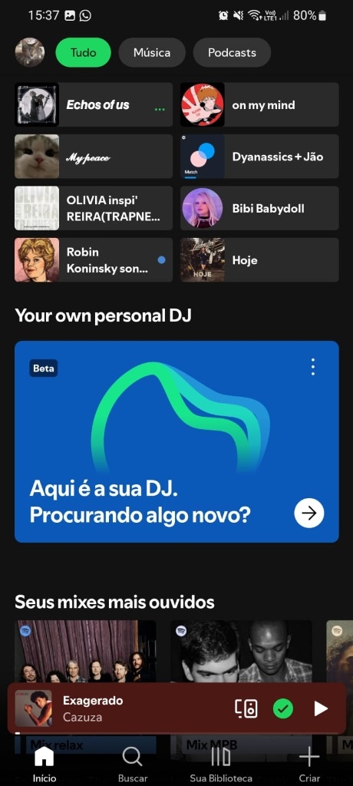
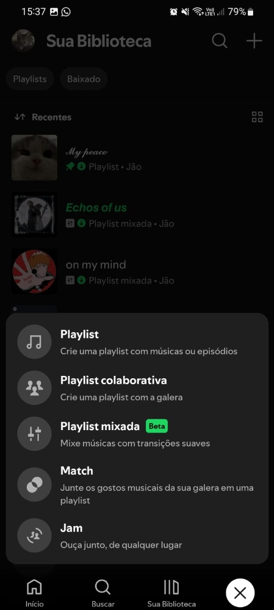
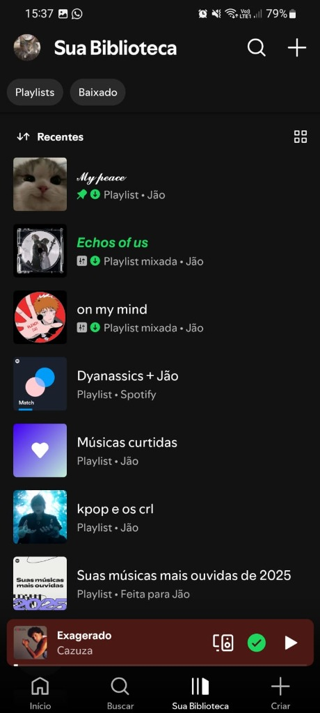
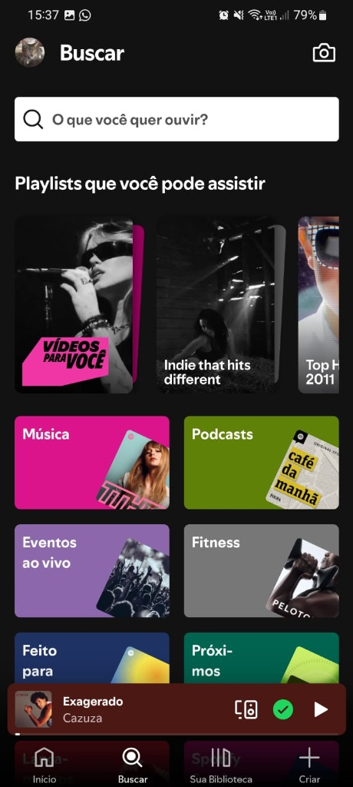
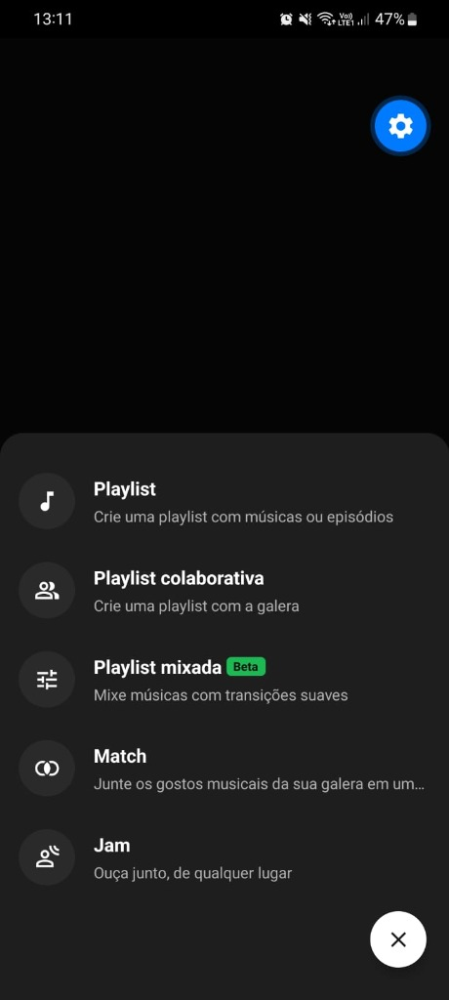
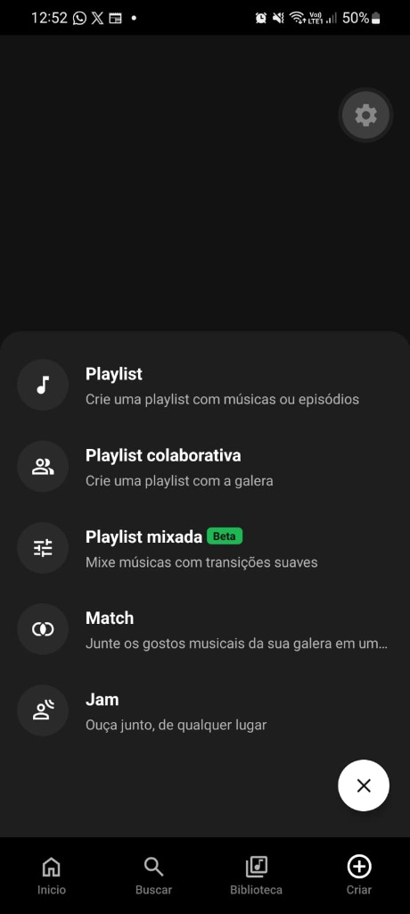
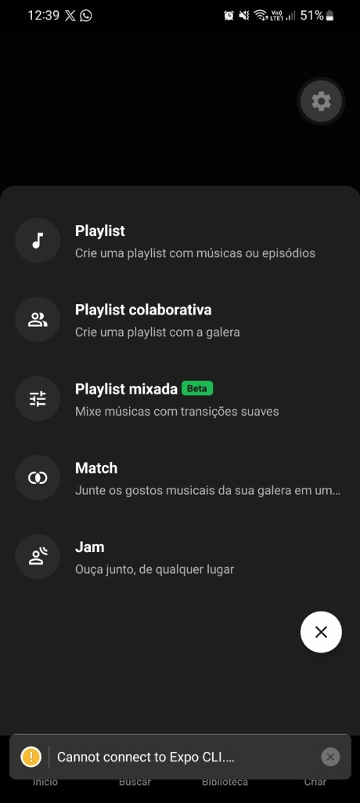
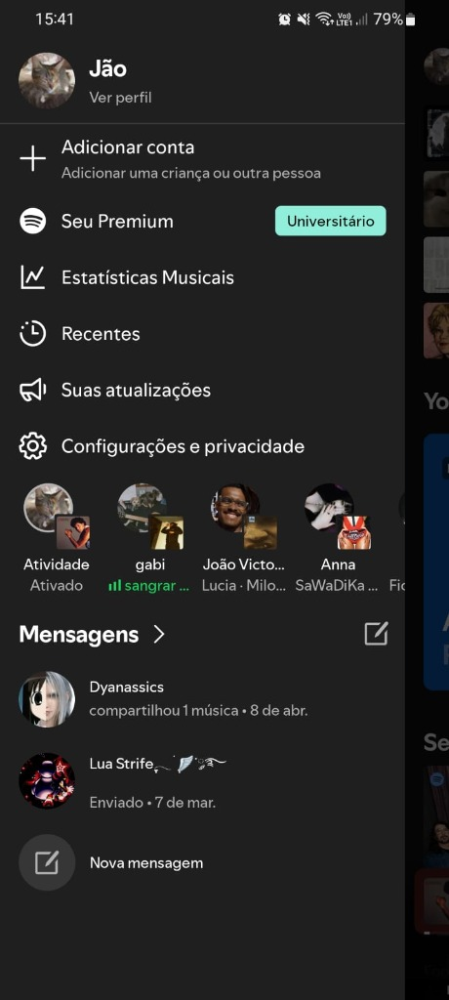
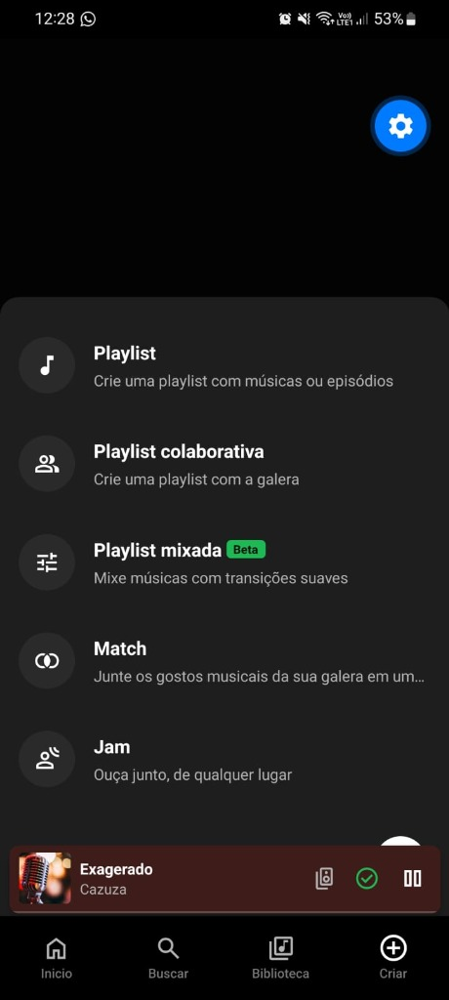

# 🎧 Spotiflow Mobile — Projeto P1

> **Disciplina:** Desenvolvimento de Aplicativos Híbridos  
> **Professor:** Márcio Garrido  
> **Instituição:** Universidade de Vassouras (Univassouras)  
> **Integrantes (Dupla):** Ian & Dupla / Jão  
> **Tecnologias:** React Native, Expo Router (SDK 57), TypeScript  

---

## 📌 Sobre o Projeto

Fala pessoal! Esse aqui é o **Spotiflow**, o app mobile desenvolvido como projeto prático para a avaliação da **P1** na disciplina de Desenvolvimento de Aplicativos Híbridos.

A ideia principal do projeto foi reproduzir a experiência visual, o design system escuro e a usabilidade do **Spotify Mobile**, construindo uma aplicação híbrida moderna, performática e fluida utilizando **React Native com Expo Router**. 

Em vez de ficarmos só na casca de telas estáticas, o projeto conta com **10 telas totalmente navegáveis e interativas**, gerenciamento de estado global com `Context API` para reprodução contínua de áudio, navegação baseada em arquivos com rotas dinâmicas e dados simulados (mock) com músicas, artistas e playlists reais.

---

## 🚀 Como Rodar o Projeto Localmente

Para rodar o app no seu computador e testar no celular (via Expo Go) ou no navegador:

### Pré-requisitos
- **Node.js** instalado (versão 18 ou superior recomendada)
- Gerenciador de pacotes **npm** ou **yarn**
- Aplicativo **Expo Go** instalado no smartphone (Android ou iOS) se for testar no aparelho físico

### Passo a Passo

1. **Clone o repositório:**
   ```bash
   git clone https://github.com/arywnz/P1_Desenvolvimento_apps_hibridos.git
   cd P1_Desenvolvimento_apps_hibridos
   ```

2. **Acesse a pasta do app e instale as dependências:**
   ```bash
   cd spotiflow-mobile
   npm install
   ```

3. **Inicie o servidor de desenvolvimento do Expo:**
   ```bash
   npx expo start -c
   ```

4. **Executando:**
   - **No celular:** Abra o app do **Expo Go** e escaneie o QR Code que aparece no terminal (se estiver em redes Wi-Fi diferentes, pode rodar com `npx expo start --tunnel`).
   - **No navegador (Web):** Pressione `w` no terminal para abrir no navegador em modo responsivo (recomendado usar a emulação mobile do DevTools do Chrome/Edge).

---

## 🛠️ Tecnologias e Bibliotecas Utilizadas

- **[React Native](https://reactnative.dev/):** Framework para desenvolvimento híbrido multiplataforma com componentes nativos.
- **[Expo (SDK 57)](https://expo.dev/):** Ferramental robusto para build, emulação e deploy ágil.
- **[Expo Router](https://docs.expo.dev/router/introduction/):** Roteamento moderno baseado em sistema de arquivos (File-based routing), suporte a abas (`tabs`), modais nativos e rotas dinâmicas (`[id].tsx`).
- **[TypeScript](https://www.typescriptlang.org/):** Tipagem estática para contratos de dados (`Track`, `Playlist`, `FriendActivity`, `ChatMessage`), evitando bugs em tempo de execução.
- **[Expo Image](https://docs.expo.dev/versions/latest/sdk/image/):** Renderização de imagens de alta performance com suporte a cache inteligente, transições suaves e carregamento híbrido (URIs remotas e assets locais com `require`).
- **[Expo Symbols](https://docs.expo.dev/versions/latest/sdk/symbols/):** Ícones vetoriais modernos com suporte a SF Symbols no iOS e Material Icons no Android/Web.
- **React Context API:** Gerenciamento centralizado do estado do reprodutor (`PlayerContext`), mantendo a faixa atual, status de play/pause e progresso sincronizados entre Mini Player e Player Fullscreen.

---

## 📱 Fluxo de Navegação e Telas do Sistema

O aplicativo foi desenhado respeitando rigorosamente a hierarquia visual do Spotify. Abaixo está a explicação detalhada de cada fluxo acompanhada dos prints das telas:

---

### 1. Tela Inicial (Home)
É o ponto de entrada do usuário. Conta com filtros rápidos no topo ("Tudo", "Música", "Podcasts"), grade de atalhos para as playlists mais acessadas recentemente, card exclusivo do DJ com recomendação por voz simulada e carrossel horizontal de mixes diários. No rodapé, o Mini Player permanece fixo e acessível.

<p align="center">
  
</p>

* **Interações:** 
  - Tocar no avatar no topo leva para o menu de **Perfil do Usuário**.
  - Tocar em qualquer card de playlist abre os detalhes daquela playlist.
  - Tocar no Mini Player expande o player em tela cheia.

---

### 2. Tela de Busca e Gêneros (Search)
Interface dedicada à descoberta de conteúdo. Possui campo de busca interativo com resposta imediata e cards coloridos categorizados por gêneros e ocasiões (Música, Podcasts, Eventos ao Vivo, Fitness, Rock, MPB, etc.).

<p align="center">
  
</p>

* **Interações:**
  - Permite digitar o nome de músicas ou artistas filtrando os resultados.
  - Tocar nos cards de categoria exibe os vídeos e coleções selecionadas.

---

### 3. Sua Biblioteca (Your Library)
Central de gerenciamento das coleções do usuário. Apresenta filtros em estilo pílula ("Playlists", "Álbuns", "Artistas"), botão de adicionar/criar nova playlist (`+`) e ordenação dinâmica por atividade recente.

<p align="center">
  
</p>

* **Interações:**
  - Lista todas as playlists criadas, incluindo as **Músicas curtidas do Ian** (fixada com ícone de pin).
  - Tocar no botão `+` abre o modal de criação rápida (Criar playlist, Match ou Jam).

---

### 4. Detalhes da Playlist e Lista de Faixas
Tela dinâmica (`src/app/playlist/[id].tsx`) que carrega automaticamente as faixas, capas personalizadas e créditos de qualquer playlist selecionada (tanto do usuário quanto dos amigos).

<p align="center">
  
</p>

* **Destaques do Mock Realista:**
  - Capa de **Final Fantasy VII Remake** para a playlist *"Echos of us"*, acompanhada pelas trilhas sonoras icônicas de *Final Fantasy VII* (Nobuo Uematsu) e *The Witcher 3: Wild Hunt* (Marcin Przybyłowicz).
  - Capa de **NewJeans** para a playlist de K-Pop com hits reais de BTS, BLACKPINK e LE SSERAFIM.
  - Botão verde flutuante de Play com toggle dinâmico de Play/Pause.
  - Toque em qualquer faixa para começar a reprodução imediata no player global.

---

### 5. Player de Música em Tela Cheia (Fullscreen Player)
Modal aberto ao clicar no Mini Player. Apresenta arte da capa em destaque, barra de controle com tempo decorrido e restante da música, botões de retroceder, avançar, aleatório (shuffle), repetição em loop e curtir.

<p align="center">
  
</p>

* **Interações:**
  - Controle de reprodução em tempo real com barra de progresso.
  - Botão de minimizar no canto superior para voltar à navegação sem interromper o som.

---

### 6. Perfil do Usuário e Atividade de Amigos
Acessível pelo topo da Home e da Biblioteca, essa tela reúne o perfil ativo (**Jão**, plano Universitário) e traz a funcionalidade de **Atividade de Amigos em Tempo Real**.

<p align="center">
  
  &nbsp;&nbsp;&nbsp;&nbsp;
  
</p>

* **Interações:**
  - Mostra o status e o que cada amigo está escutando no momento.
  - Cada amigo possui gostos musicais diferentes (o professor **Márcio Garrido** com clássicos do Hard Rock e Heavy Metal, Gabriela com Indie e Acústico, Camila com Lo-Fi e Jazz, Lucas Ferreira com Sertanejo).
  - Tocar no card de qualquer amigo abre o **Perfil do Amigo**.

---

### 7. Configurações e Privacidade (Settings)
Interface de ajustes inspirada fielmente nas opções do Spotify, categorizada em seções funcionais com toggles nativos (`Switch`).

<p align="center">
  
</p>

* **Ajustes disponíveis:**
  - **Reprodução:** Modo sem pausas (Gapless), Normalização de áudio e Autoplay.
  - **Economia de Dados:** Download apenas em Wi-Fi e qualidade de streaming.
  - **Privacidade & Social:** Sessão privada e transmissão de atividade para amigos.
  - **Atalhos internos:** Links diretos para gerenciamento de conta e estatísticas.

---

### 8. Conversas e Compartilhamento de Músicas (Direct Chat)
Área de mensagens diretas que permite interagir com os amigos, bater papo e escutar faixas compartilhadas diretamente pelo balão da mensagem.

<p align="center">
  
</p>

* **Interações:**
  - Campo de texto para digitar e enviar novas mensagens em tempo real.
  - Card integrado da faixa compartilhada com botão de play direto dentro da conversa.

---

### 9. Central de Conta e Multicontas (Account Hub)
Tela detalhada para administração da conta, permitindo alternar entre perfis, configurar o plano Universitário e visualizar lançamentos recentes e atualizações.

<p align="center">
  
</p>

---

## 📂 Estrutura de Pastas do Projeto

A arquitetura do código foi estruturada com foco na separação de responsabilidades e na facilidade de manutenção:

```plaintext
P1_Desenvolvimento_apps_hibridos/
├── docs/
│   └── screenshots/              # Prints de demonstração das telas do app
├── spotiflow-mobile/
│   ├── assets/
│   │   └── images/               # Fotos de perfil locais, capas de playlists e logos
│   ├── src/
│   │   ├── app/                  # Rotas do Expo Router (File-based Routing)
│   │   │   ├── (tabs)/           # Abas principais (Home, Busca, Biblioteca)
│   │   │   │   ├── _layout.tsx   # Configuração da barra inferior de abas
│   │   │   │   ├── index.tsx     # Tela Home
│   │   │   │   ├── search.tsx    # Tela de Busca
│   │   │   │   └── library.tsx   # Tela da Biblioteca
│   │   │   ├── playlist/
│   │   │   │   └── [id].tsx      # Rota dinâmica para detalhes de playlists
│   │   │   ├── _layout.tsx       # Root layout e injeção do PlayerContext
│   │   │   ├── account.tsx       # Tela de detalhes da conta e multicontas
│   │   │   ├── chat.tsx          # Tela de conversa direta (Direct Message)
│   │   │   ├── create-modal.tsx  # Modal transparente de criação rápida
│   │   │   ├── friend-profile.tsx# Perfil individualizado de amigos
│   │   │   ├── player.tsx        # Player modal em tela cheia
│   │   │   ├── profile.tsx       # Perfil do usuário e gaveta de amigos
│   │   │   └── settings.tsx      # Configurações e privacidade
│   │   ├── components/
│   │   │   └── MiniPlayer.tsx    # Componente global de mini player flutuante
│   │   ├── constants/
│   │   │   ├── mockData.ts       # Base de dados mockada (faixas, playlists, amigos)
│   │   │   └── theme.ts          # Design tokens (cores oficiais, tipografia e espaçamentos)
│   │   └── context/
│   │       └── PlayerContext.tsx # Context API gerenciando estado global do player
│   ├── app.json                  # Configurações do Expo
│   ├── package.json              # Dependências e scripts do projeto
│   └── tsconfig.json             # Configurações do TypeScript
├── .gitignore                    # Regras de exclusão do Git (node_modules, caches)
└── README.md                     # Documentação completa do projeto
```

---

## 🎯 Requisitos da Avaliação P1 Atendidos

| Requisito Avaliado | Situação | Detalhes no Projeto |
| :--- | :---: | :--- |
| **Mínimo de 6 telas navegáveis** | ✅ **Superado** | O app conta com **10 telas completas e interativas** (Home, Busca, Biblioteca, Criar Modal, Playlist Dinâmica, Player Fullscreen, Perfil, Configurações, Chat e Perfil do Amigo). |
| **Histórico mínimo de 20 commits** | ✅ **Superado** | Histórico com **mais de 30 commits** estruturados, com mensagens semânticas em português documentando a evolução do desenvolvimento passo a passo. |
| **Integridade do Repositório** | ✅ **Atendido** | Repositório limpo sem pastas `node_modules/` ou builds acidentais comitadas, graças ao `.gitignore` devidamente configurado. |
| **Experiência e Estética Fiel** | ✅ **Atendido** | Identidade visual escura do Spotify, paleta de cores HSL personalizada, fontes modernas, microanimações nos botões e estados de feedback ao tocar. |
| **Dados Realistas sem Duplicações** | ✅ **Atendido** | Músicas, artistas, álbuns e durações reais, capas personalizadas exclusivas e playlists com identidades temáticas bem definidas. |

---

*Trabalho prático desenvolvido com dedicação para a disciplina de Desenvolvimento de Aplicativos Híbridos — Univassouras.*
